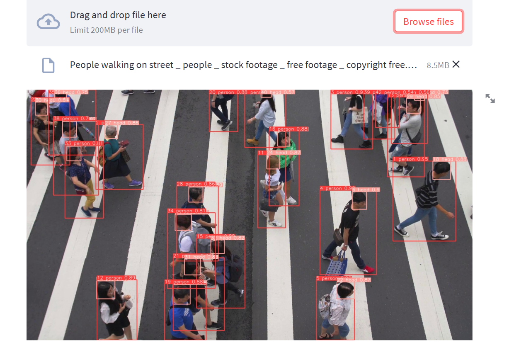

<h1 id="top_page">Cài đặt chương trình</h1>

### [Tổng Hợp cú pháp chạy chương trình](#total_command)

1. <a href="#install_py">Cài đặt python</a>

2. <a href="#install_lib">Cài đặt thư viện</a>

3. <a href="#download_video">Tải xuống thư mục video cho chương trình</a>

4. <a href="#fix_more">Khắc phục lỗi</a>

5. <a href="#result_program">Kết quả chương trình</a>

<p id="install_py">
<a href="https://fa.getpedia.net/data?q=1EDM1YjN4UDO1QTN1UjN4MjN8JDMzATM8VGel5CdpJmMz0CMtgTLz0ibvhGd5B3LxIzLwEzL5EDMy8SZslmZvEGdhR2L">Tải xuống python v3.8.0</a>
</p>

<p id="install_lib"><b>Cài đặt thư viện cần thiết</b></p>

```bash
pip install matplotlib==3.2.2
```

```bash
pip install numpy==1.18.5
```

```bash
pip install opencv-python==4.1.2.30
```

**_Trường hợp bị lỗi khi cài pillow_**

```bash
pip install Pillow>=7.1.2
```

**_thì dùng lệnh sau_**

```bash
pip install -f ...
```

```bash
pip install PyYAML==5.3.1
```

```bash
pip install requests==2.23.0
```

```bash
pip install scipy==1.4.1
```

```bash
pip install torch==1.8
```

```bash
pip install torchvision==0.9
```

```bash
pip install tqdm==4.41.0
```

```bash
pip install tensorboard==2.4.1
```

```bash
pip install wandb
```

```bash
pip install
```

```bash
pip install Plotting
```

```bash
pip install pandas==1.1.4
```

```bash
pip install seaborn==0.11.0
```

```bash
pip install streamlit==1.1.0
```

hoặc

```bash
pip install streamlit==1.21.0
```

```bash
pip install streamlit-webrtc==0.32.0
```

```bash
pip install googledrivedownloader
```

```bash
pip install thop
```

```bash
pip install easydict
```

<b>hoặc dùng lệnh <b>khi clone mã nguồn</b></b>

```bash
pip install -r requirements.txt
```

**Sau khi cài đặt mã nguồn thì dùng lệnh sau để chạy chương trình trong môi trường web:**

```bash
streamlit run app.py
```

### Hiển Thị Được Giao Diện Web Sau:


### Tiếp theo chọn vào -> <i>Browser Files</i>


#### Chọn vào tải về từ mã nguồn và được kết quả như sau:



# Tổng hợp chạy file chương trình { #total_command}

|   Tên file   |           Cú Pháp            |                        Mục đích                         |
| :----------: | :--------------------------: | :-----------------------------------------------------: |
|  webcam.py   |  `streamlit run webcam.py`   |         Theo dõi đối tượng trực tiếp qua webcam         |
| nextframe.py | `streamlit run nextframe.py` | Chạy video với tốc độ nhanh hơn do di chuyển khung hình |
|    app.py    |    `streamlit run app.py`    |           File gốc không có 2 chức năng trên            |

<h1 id="fix_more">Khắc phục lỗi</h1>
1. Lỗi file <b>crowdhuman_yolov5m.pt</b>

thì tải xuống file tại đây [https://drive.google.com/file/d/1zPGZ6kr2A9mx3LzSJN2pUdC9Fna7PJN9/view?usp=drive_link] và copy file vừa tải về ghi đè lên (overide)

2. Lỗi file <b>ckpt.t7</b>

thì tải xuống file tại đây => [https://drive.google.com/file/d/1rplWhXBWRm8JOhCjqz6tGABQ7KTjiUqx/view?usp=drive_link] và copy file vừa tải về ghi đè lên (overide) file cũ

<h4 id="download_video">Thư mục tải video cho chương trình</h4>

-   [Video Test 1](https://drive.google.com/file/d/1Z_3RjO9zkKUUqoyK20ykFifZPWch3dsY/view?usp=drive_link)

-   [Video Test 2](https://drive.google.com/file/d/1_0sAg5yvUX75WhsW1UfnIFRNNmWlU32n/view?usp=drive_link)

### Chú ý nếu lỗi do thiếu công cụ thì tải thêm

1. [Tải Xuống Công Cụ VSCdit.exe](https://download.visualstudio.microsoft.com/download/pr/1754ea58-11a6-44ab-a262-696e194ce543/3642E3F95D50CC193E4B5A0B0FFBF7FE2C08801517758B4C8AEB7105A091208A/VC_redist.x64.exe)

2. [Tải xuống Visual Studio C++](https://aka.ms/vs/17/release/vs_BuildTools.exe)

-   ### Tài liệu tham khảo

    1. Tương thích pytorch:
       https://github.com/pytorch/vision#installation

    2. Đường dẫn video:
       https://mazwai.com/video/view-of-pedestrian-crossing-taiwan/455371

<a href="#top_page">Cuộn lên đầu trang -> TO UP</a>
